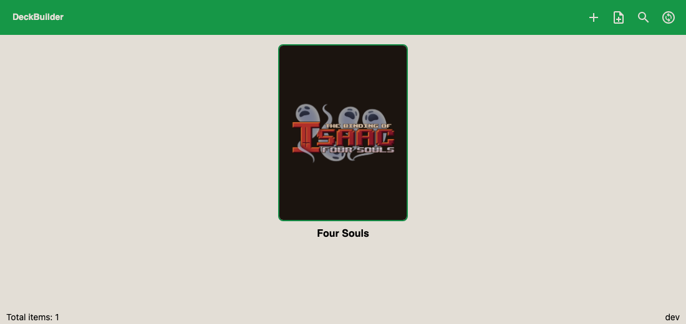
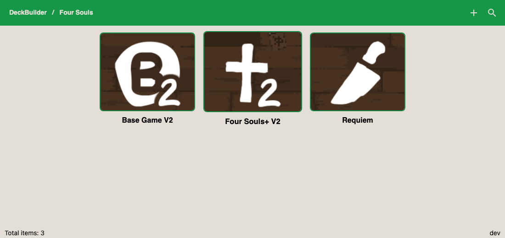
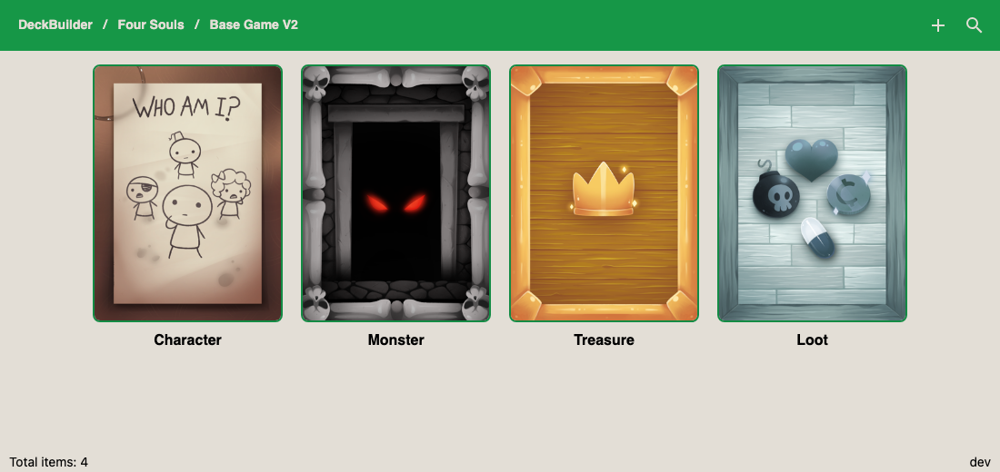
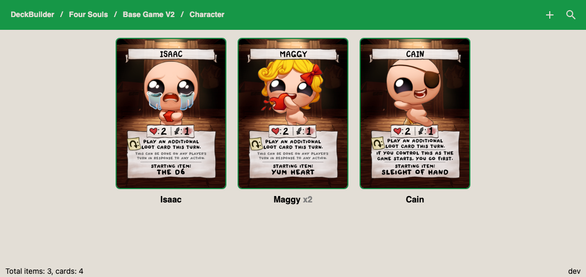

# Using DeckBuilder

DeckBuilder is a desktop app for building a card game and handing it to [Tabletop Simulator](https://tabletopsimulator.com/). You keep the cards as data. The app draws the sprite sheets and writes the save file TTS knows how to load.

The pictures below use art from [The Binding of Isaac: Four Souls](https://foursouls.com/). They show the four levels of the catalog. DeckBuilder is not affiliated with that game.

## What you can do

1. Build a game as four levels: **game → collection → deck → card**.
2. Give every level a picture. A deck's picture is the **card back**.
3. Put a name, a description, Lua variables, and a copy count on each card.
4. Search and sort the level you are looking at.
5. Export a game as a zip, import a zip, or duplicate a game.
6. **Render** a game. That writes PNG and JPEG sheets plus one JSON file.
7. Spawn that result into a running TTS game, or copy the JSON into Saved Objects.
8. Swap local image paths in that JSON for hosted URLs. Steam Cloud steps are on [Steam Cloud](Steam-Cloud).

## Why this instead of the TTS editor

TTS can already make a custom deck. You drop in a face sheet, a back, and a grid size, then place copies on the table by hand. That is enough for a handful of cards.

A whole card game is a different job. The source of each card lives outside the sheet. One card may need several copies. Cards carry their own numbers (hit points, attack, and so on) for a script. An expansion is a group of decks, not one more URL pasted into a deck object.

DeckBuilder keeps that structure, then generates what TTS wants:

| | TTS custom deck | DeckBuilder |
|---|---|---|
| Where the cards live | Inside one object you already spawned | A catalog you can edit and render again |
| Sheet layout | You build the grid | The app packs faces, up to 10×7, and reserves the last cell the way TTS does |
| Copies | Duplicate objects on the table | A count on the card |
| Per-card numbers | Lua you write on each object | Variables stored on the card and written into its script at render |
| Several decks | One custom object at a time | A game bag, then a bag per collection, then the decks |
| Sharing the files | Local paths until you rehost them yourself | The same limit today. [Steam Cloud](Steam-Cloud) is the manual way to turn a rendered table into cloud URLs |

Render still writes `file:///` paths. Friends cannot see those pictures until the images are hosted. The app does not upload them for you.

## The window

The bar at the top is the path. **DeckBuilder** is the list of games. Click a picture to go deeper. The icons on the right are create, and on the game list also import and replace, plus search and sort.

Right-click a picture for Change and Delete. On a game you also get Export, Duplicate, and Render. Double-click a card to edit it.

## Game

A game is the whole product. Four Souls is one game. Its picture is just an image you attach. Here it is the official logo.

Create a game with the plus icon. You can paste an image URL or pick a file. Import reads a zip another DeckBuilder export produced.

## Collection

A collection is a box inside the game: the base set, or an expansion. Open the game and you see its collections.

The picture is whatever you attach. In this example the three covers are the set marks from the site: Base Game V2, Four Souls+ V2, and Requiem.

## Deck

A deck is one pile inside a collection. **The deck picture is the card back** for every card in that pile. Render refuses to run if a deck has no back.

These four backs are the Character, Monster, Treasure, and Loot decks from Four Souls.

## Card

A card is one face. It has a name, a description, an image, optional variables such as `HP` and `AT`, and a count. The count is how many copies land in the rendered deck. A count above 1 shows on the tile as `x2`.

Clicking a card does not open another level. This is the bottom of the catalog.

## Render

Right-click the game and choose **Render**. A progress circle covers the window until the job finishes.

The app writes into `DeckBuilderData/result` (on macOS, `~/DeckBuilderData/result`):

1. One JPEG sheet per page of a deck. Faces fill the grid. The back sits in the last cell.
2. A PNG of that back.
3. One JSON file named after the game.

Copy that JSON into `Documents/My Games/Tabletop Simulator/Saves/Saved Objects`, then spawn it from Saved Objects in TTS. If TTS is already open when you render, the app also tries to drop the bag onto the current table.

Leave the pictures in `result/`. The JSON points at those files on your disk.

To let other players see the cards, follow [Steam Cloud](Steam-Cloud). That page is the click-path inside TTS that uploads the loaded sheets and rewrites the live table onto cloud URLs.

## Art

Card faces, card backs, and the logo are from [foursouls.com](https://foursouls.com/), the site for The Binding of Isaac: Four Souls. The files in `images/foursouls/` are those images, scaled down for this wiki. They are an example catalog, not assets shipped with DeckBuilder.

After the window layout changes, regenerate the four pictures with `make screenshots`.
